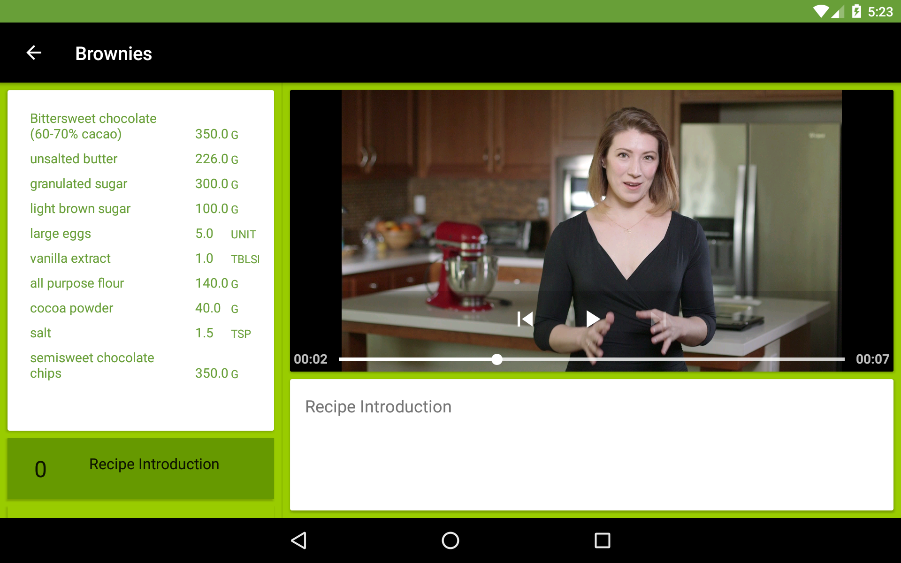
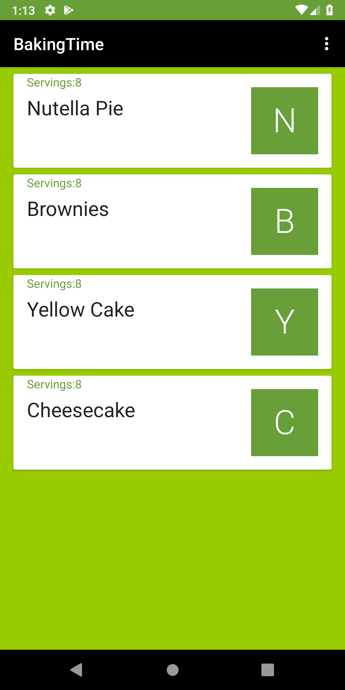
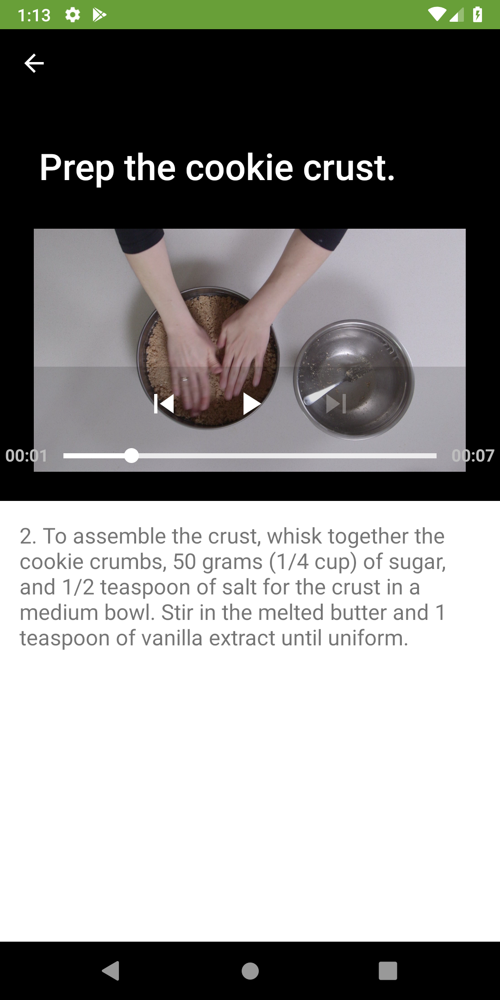

# Android BakingTime App

The project is part and 3rd project of Udacity Android Developer
Nanodegree. Android BakingTime App allows to share JSON formatted
recipes from fixed http-endpoint.

## General

App displays recipes from fixed http-endpoint. Project demonstrates
* Exoplayer to display videos
* Widget for app experience
* Fragments to create responsive design that works both in phones and
  tablets
* Tests intents with Espresso

## Libraries

Picasso Parceler Retrofit ExoPlayer TextDrawable

## Screenshots

## License

Licensed under the Apache License, Version 2.0 (the "License"); you may
not use this file except in compliance with the License. You may obtain
a copy of the License at

        http://www.apache.org/licenses/LICENSE-2.0

Unless required by applicable law or agreed to in writing, software
distributed under the License is distributed on an "AS IS" BASIS,
WITHOUT WARRANTIES OR CONDITIONS OF ANY KIND, either express or implied.
See the License for the specific language governing permissions and
limitations under the License.
